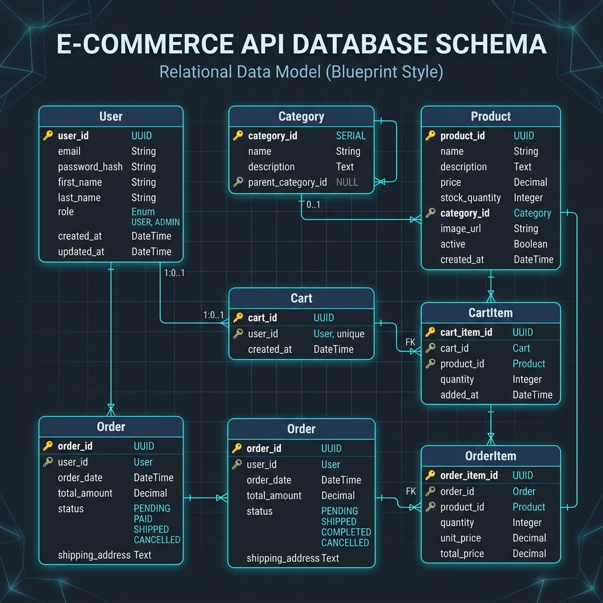

# E-Commerce API (Week 5 - Part 1)

This is my backend project for Week 5 of the Webthism Full Stack/Backend Developer Internship. It is a REST API for an e-commerce platform built using Node.js, Express, TypeScript, and Prisma ORM with a SQLite database.

## Tech Stack
* **Runtime / Framework:** Node.js, Express (v5)
* **Language:** TypeScript
* **Database & ORM:** SQLite, Prisma (v7)
* **Authentication:** JWT (jsonwebtoken) and password hashing with bcryptjs

## Database Schema Relationship

Here is the visual diagram illustrating the relations between our models (`User`, `Category`, `Product`, `Cart`, `CartItem`, `Order`, `OrderItem`):



### Relationship Rules
* **User & Cart**: One-to-one relationship. Every user receives a unique cart automatically upon registration.
* **User & Orders**: One-to-many relationship. A user can place multiple orders.
* **Category & Products**: One-to-many relationship. A category contains multiple products.
* **Cart & CartItems**: One-to-many relationship. A cart can hold multiple items.
* **Product & CartItems/OrderItems**: One-to-many relationship. A product can be referenced across multiple cart and order items.
* **Order & OrderItems**: One-to-many relationship. An order contains multiple purchased product items.

## Project Setup

1. **Install dependencies:**
   ```bash
   npm install
   ```

2. **Environment Variables:**
   Create a `.env` file in the root directory (already configured locally):
   ```env
   DATABASE_URL="file:./dev.db"
   PORT=3000
   JWT_SECRET="webthism-super-secret-e-commerce-key-2026"
   ```

3. **Run database migrations:**
   ```bash
   npm run db:migrate --name init
   ```

4. **Start the server:**
   ```bash
   npm run dev
   ```
   The server will start running at `http://localhost:3000`.

## API Endpoints

### Auth
* `POST /api/auth/register` - Registers a new user or admin.
  * Body: `{ "email": "...", "password": "...", "role": "USER" }` (or `"ADMIN"`)
* `POST /api/auth/login` - Logs in and returns a JWT token.
  * Body: `{ "email": "...", "password": "..." }`

### Categories
* `GET /api/categories` - Returns all categories.
* `POST /api/categories` - Creates a new category (Admin only).
  * Body: `{ "name": "...", "description": "..." }`

### Products
* `GET /api/products` - Returns a list of products. Supports query filters:
  * `categoryId`: Filter by category
  * `search`: Keyword search across names and descriptions
  * `minPrice` / `maxPrice`: Filter by price range
  * `sortBy` / `order`: Sort products (e.g. `price`, `stock`, `createdAt` asc/desc)
* `GET /api/products/:id` - Returns details of a specific product.
* `POST /api/products` - Creates a new product (Admin only).
  * Body: `{ "name": "...", "price": 100, "stock": 10, "categoryId": "..." }`
* `PUT /api/products/:id` - Updates a product (Admin only).
* `DELETE /api/products/:id` - Deletes a product (Admin only).

## Testing

I wrote an integration test script to verify that all the routes, filters, and role-based permissions work correctly. 

You can run the tests using:
```bash
npx ts-node test-api.ts
```
